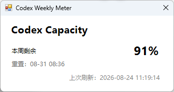

# Codex Weekly Meter

一个 Windows Codex 额度托盘小工具。项目使用 OpenAI 官方 Codex CLI
作为本地额度数据源，依赖已锁定在 `package-lock.json` 中。

## 功能

- 托盘图标直接显示每周剩余百分比
- 任务栏上方常驻显示每周剩余额度
- 左键查看每周额度和重置时间
- 每 1 分钟刷新，并监听 Codex 的实时额度更新
- 网络临时失败时保留最后成功值并显示“暂存”，不会退回 `--%`
- 低于 20%、10%、5% 时提醒
- 可选开机启动
- 不读取或保存 Codex 密码、Token；数据来自本机 `codex app-server`

## 运行

双击 `Start-CodexWeeklyMeter.vbs`。第一次运行后，可右键托盘图标并勾选“开机启动”。

如果移动到另一台电脑，先在项目目录执行一次：

```powershell
npm.cmd install
```

也可以在 PowerShell 中运行：

```powershell
powershell.exe -NoProfile -ExecutionPolicy Bypass -STA -File .\CodexWeeklyMeter.ps1
```

退出请右键托盘图标，选择“退出”。

常驻状态条默认显示在任务栏右上方。左键点击可展开详细信息，
右键选择“显示常驻状态条”可以隐藏或重新显示。

## 自测

```powershell
powershell.exe -NoProfile -ExecutionPolicy Bypass -File .\tests\Test-Core.ps1
```

托盘界面冒烟测试：

```powershell
powershell.exe -NoProfile -ExecutionPolicy Bypass -STA -File .\CodexWeeklyMeter.ps1 -SmokeTest
```

连接已登录的本机 Codex 做集成测试：

```powershell
powershell.exe -NoProfile -ExecutionPolicy Bypass -File .\tests\Test-AppServer.ps1
```

## 数据说明

程序启动一个本地 `codex app-server --stdio` 子进程，完成初始化后调用
`account/rateLimits/read`，并监听 `account/rateLimits/updated`。接口返回的
`usedPercent` 是已使用比例，界面显示的是 `100 - usedPercent`。

日志保存在 `%LOCALAPPDATA%\CodexWeeklyMeter\meter.log`。

## 截图



